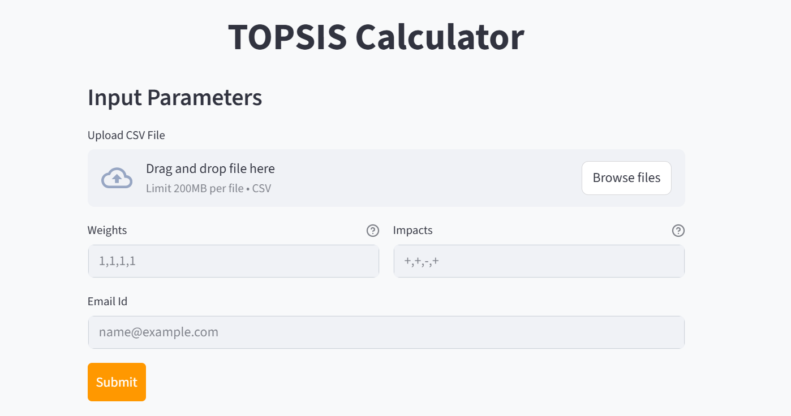
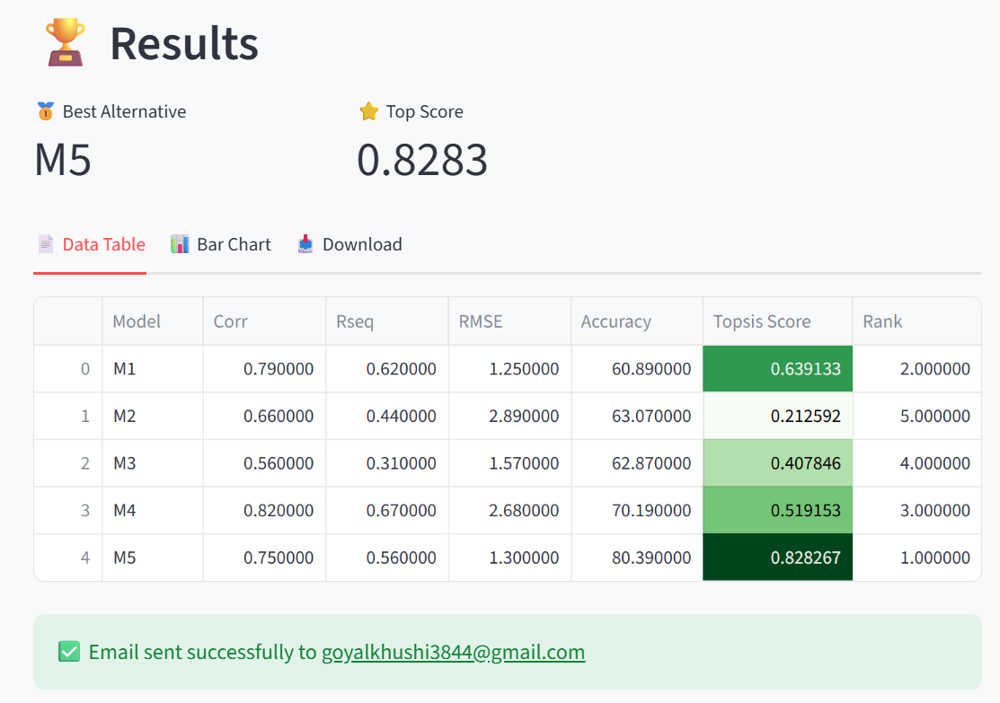

# **Title: TOPSIS-Khushi-102303993**
**Technique for Order of Preference by Similarity to Ideal Solution**

## **1. Methodology**
TOPSIS is a multi-criteria decision analysis method that is based on the concept that the chosen alternative should have the shortest geometric distance from the positive ideal solution (PIS) and the longest geometric distance from the negative ideal solution (NIS).

**Step-by-step implementation:**
1.  **Establish the decision matrix:** Organizing criteria and alternatives.
2.  **Normalize the decision matrix:** Scaling values to a comparable range.
3.  **Calculate weighted normalized decision matrix:** Applying user-defined weights.
4.  **Determine Ideal Solutions:** Identifying the best (PIS) and worst (NIS) values for each criterion.
5.  **Calculate Separation Measures:** Computing Euclidean distances from PIS and NIS.
6.  **Calculate Relative Closeness:** generating the final TOPSIS score and Ranking.

## **2. Description**
This project provides a comprehensive solution for decision-making problems using the TOPSIS algorithm. It is available in two formats:
1.  **Python Package (PyPI):** A command-line library for integrating TOPSIS into Python workflows.
2.  **Web Application (Streamlit):** A user-friendly web interface where users can upload data, define weights/impacts, and get results instantly via email.

**Key Features:**
* Dynamic weight and impact handling.
* Automatic input validation (numeric checks, file format).
* Interactive visualizations (Bar charts).
* Email integration for sending reports.

## **3. Input / Output**
**Input Format:**
* A CSV file containing numerical data.
* First column: Object/Alternative names (e.g., M1, M2, M3).
* Remaining columns: Criteria values (numeric).

**Example Input:**
| Model | Storage | Camera | Price | Looks |
| :--- | :--- | :--- | :--- | :--- |
| M1 | 64 | 12 | 250 | 5 |
| M2 | 32 | 8 | 200 | 4 |
| M3 | 128 | 16 | 300 | 3 |

**Output:**
The tool generates a CSV file with two additional columns: **Topsis Score** and **Rank**.

## **4. Live Link**
**Web App:** [https://topsis-khushi.streamlit.app/](https://topsis-khushi.streamlit.app/) 
*(Note: Replace with your actual deployed link if different)*

**PyPI Package:** [https://pypi.org/project/Topsis-Khushi-102303993/](https://pypi.org/project/Topsis-Khushi-102303993/)

## **5. Screenshots of the Interface**

### **Dashboard & Input Section**
*(Replace the link below with your actual screenshot of the dashboard)*

### **Results & Visualization**
*(Replace the link below with your actual screenshot of the results tab)*
